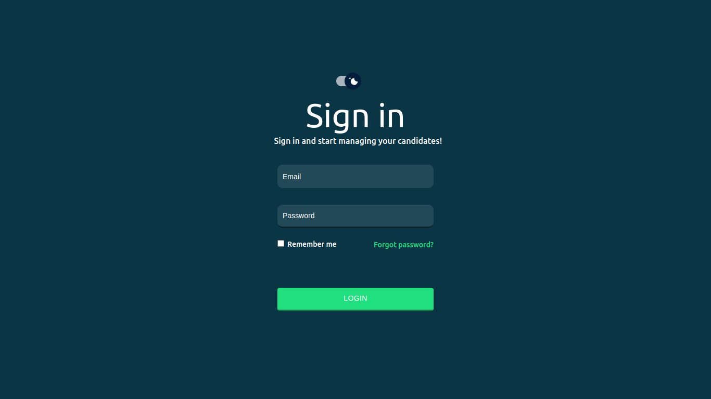
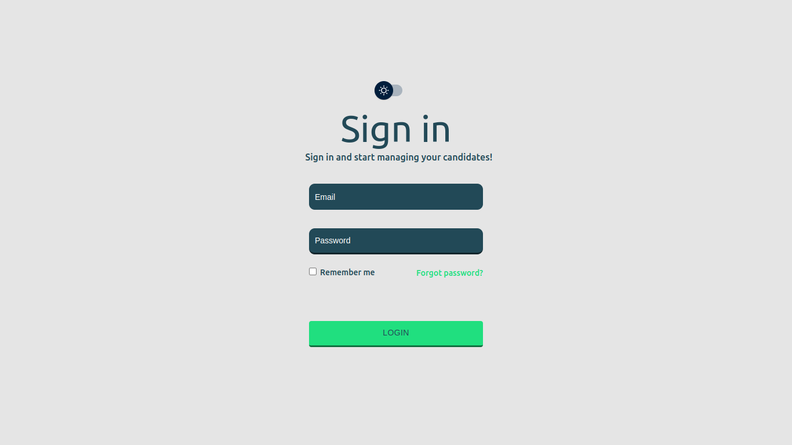

# Login System (CSS-in-JS)

## Tela de Login desenvolvida com React e Styled-Components

### Este projeto foi desenvolvido com o objetivo de aprender sobre CSS-in-JS utilizando a Biblioteca Styled-Components.

 
principal feature desse projeto é o Theme Switcher feito com Styled-Components e o uso do método GlobalStyle.

 

## Dark Mode

 

## Light Mode
